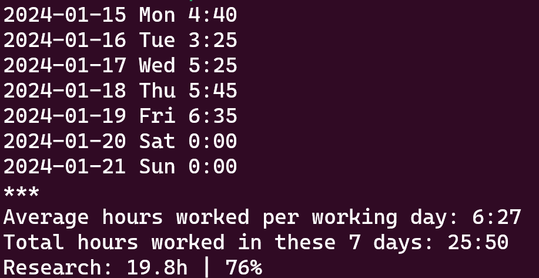
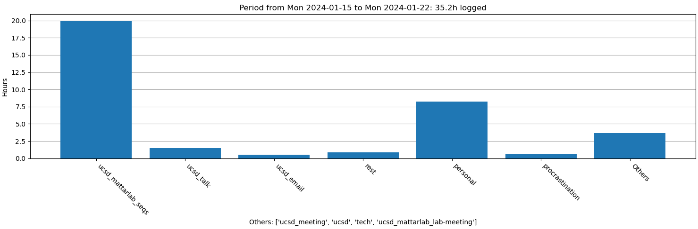
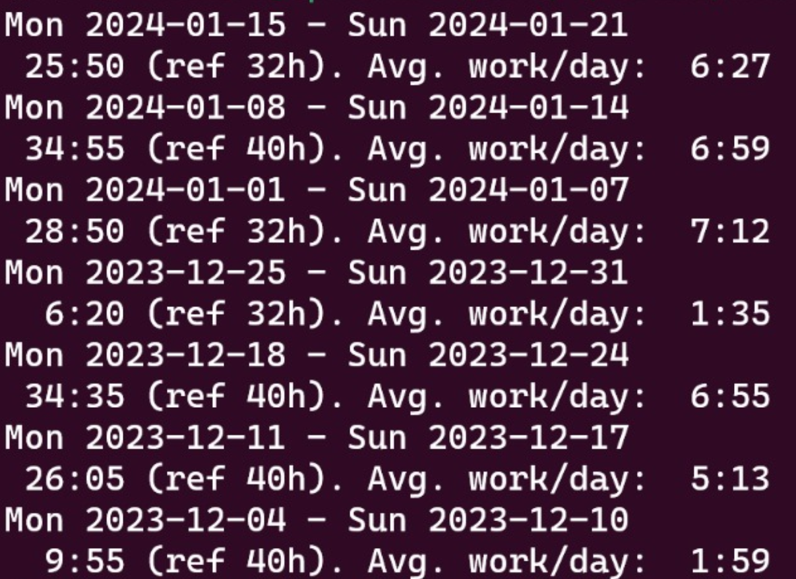

# Work Journal

This is a command-line interface (CLI) tool written in Python to help visualize sequentially text files where I keep my work 
journals. They contain the goals for the day and which of them were executed. For the executed goals, I often include a 
description of what I did. 

Importantly, there are also functionalities to keep track of the time spent on different task categories. It is possible to 
see the total amount of hours worked per day, per week or per month. Whenever they are shown, they are compared to a 
reference of a 8h-workday.

It is also possible to add vacations and holidays in the corresponding `vacations` and `holidays` files. 
The days in these files will not be counted when calculating the reference of the amount of hours that should be worked to 
reach the 8h-workday (but the hours worked on those days *will* be counted towards meeting the reference).

## Work journal format

Just create a text file named with the current date (YYYY-MM-DD format) and `.txt` extension.

Example file `2024-01-17.txt`:

    * task 3 (e.g. read emails)
    * ...
    * ...
    
    done:
    * task 1 (e.g. fix bug in code)
    * task 2 (e.g. read paper discussion)
    
    ^Tprocrastination=0:30
    ^Treading=5:20
    ^Tucsd=3:05
    ^Tpersonal=0:10
    
    ^S10:25^E11:45
    ^S12:50^E17:30
    ^S18:45^L22:15

The amount of work time in each category should be documented with the format `^Tcategory=H:MM`. This "tag" is read 
by `view.py` to count the amount of hours worked in each category and summed over the day/week/month.

## How to run

    usage: view.py [-h] [-c COUNT] [-m MONTHS] [-w WEEKS] [-t] [-p] [-g] [n_files]
    
    positional arguments:
      n_files               number of days to be displayed
    
    optional arguments:
      -h, --help            show this help message and exit
      -c COUNT, --count COUNT
                            print the number of hours worked in the last "c" days
      -m MONTHS, --months MONTHS
                            print the number of hours worked in the last "m" months
      -w WEEKS, --weeks WEEKS
                            print the number of hours worked in the last "w" weeks
      -t, --test            run application tests.
      -p, --plot            plot all activities of the current week.
      -g, --group           plot all activities of the current week grouped by tags.

## Example runs
`$ python view.py 5`

Sequentially prints in the command line the content of the last 5 days.

`$ python view.py -c 7`

Calculates worked hours for the last 7 days.

And plots work time in different categories:

OBS: the plot above and the text output above don't match because they were run in different days and they count different 
number of days. Otherwise they are consistent. Also note that "hours logged" (mentioned in the plot title) includes hours 
logged as "personal" and/or "procrastination", while worked hours (in the text output) don't include those.

`$ python view.py -w 7`

Calculates worked hours for the last 7 weeks.

## TODO

* enable personal subcategories
* enable counting personal hours
